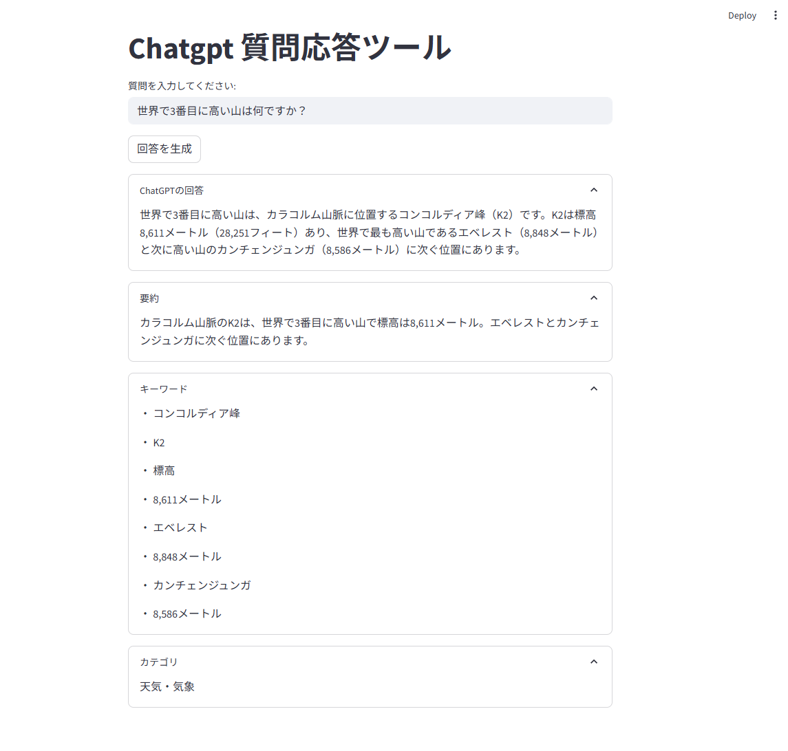

```
# ChatGPT 質問応答ツール

このアプリは ChatGPT API を利用して、ユーザーの質問に回答し、要約・キーワード抽出・カテゴリ分類を行うツールです。  
Streamlit により簡単なWebアプリとして実行できます。

---

## 🖼️ アプリ画面イメージ



※ 実行例のスクリーンショットを掲載しています。画面はExpanderを活用して整理されたUIとなっています。

---

## 🔍 主な機能

- ✅ ユーザーの質問に対する ChatGPT の回答生成
- ✅ 回答の 3 行以内の要約生成
- ✅ 回答文から重要なキーワードを抽出（リスト表示）
- ✅ 事前定義されたカテゴリ一覧から自動分類（番号選択方式）
- ✅ UI は Streamlit の Expander を活用し、整理された表示形式

---

## 🛠 使用技術

- Python 3.x
- Streamlit
- OpenAI API
- dotenv (.env ファイルで API キー管理)

---

## 🚀 使い方

### 1️⃣ 事前準備

1. OpenAI API キーを取得（ https://platform.openai.com/account/api-keys ）
2. `.env` ファイルを作成し、以下の内容を記載：

    OPENAI_API_KEY=sk-xxxxxxxxxxxxxxxxxxxxxxxxxxxxxxxx

### 2️⃣ 必要なライブラリのインストール

pip install streamlit openai python-dotenv

### 3️⃣ アプリの起動

streamlit run app_generate_answer.py

---

## 📁 ファイル構成

app_generate_answer.py    # メインアプリケーション  
.env                      # OpenAI APIキー（GitHubにはアップロードしない）  
.gitignore                # 除外設定  
README.md                 # このファイル  
images/                   # アプリ画面のスクリーンショットなど（任意）

---

## ❗️ 注意事項

- `.env` ファイルは GitHub に push しないこと（ `.gitignore` に含める ）
- OpenAI API 利用時は料金が発生する場合があるので、APIキーの管理には注意すること

---

## ✨ 今後の改善案

- UI のデザイン調整
- 回答の履歴表示機能の追加
- キーワード抽出・カテゴリ分類のカスタム設定
- 他言語対応（英語UIなど）

---

## 📄 ライセンス

MIT License

---

## 💬 作者

gentea110

```
